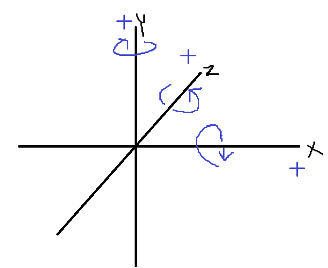

23.12.18

## 회전

### <span style="color:violet">삼각함수 활용하여 좌표 구하기
```
sin = 높이 / 빗변
cos = 밑변 / 빗변
-> 원 둘레위에 있는 정점의 좌표 = (x, y) = (cosθ, sinθ)

Q) 각도θ의 위치에 있는 좌표를 각도α 만큼 회전시켰을 때의 좌표는?
X' = cos(θ+α) = cθ*cα - sθ*sα = x*cα - y*sα
Y' = sin(θ+α) = sθ*cα + sα*cθ = y*cα + x*sα
-> 원 둘레위에 있는 정점의 좌표 = (x', y') = (x*cα - y*sα, y*cα + x*sα)
```
<br><br>

### <span style="color:violet">회전된 좌표를 행렬의 계산으로 변환
```cpp
            | c  c  0|
| x y z |   |-s  c  0|
            | 0  0  1|
```

```cpp
// [CTransform class]
relativeroatation = 각 축별로 몇도를 돌릴것인가?

// [CTransform.cpp]
// scale 변환 행렬 생성함수
XMMatrixScaling()
// rotation 변환 행렬 생성함수(X,Y,Z)
XMMatrixRotationX()
XMMatrixRotationY()
XMMatrixRotationZ()
// transform 변환 행렬 생성함수
XMMatrixTranslation()

// SRT Matrix = World Matrix = 상태행렬
world mat = local mat * scale mat * rotate mat * translation mat;
```
<br><br>

### <span style="color:violet">Player 스크립트 회전 추가
<br>
<br><br>

### <span style="color:violet">두번째 변환(Camera)
객체가 월드에 배치된 이후엔 카메라의 관점에 따라 위치가 변화되어 보일것아다.<br>
카메라 기준으로 변화된 좌표를 구하는 변환이 필요하다.<br>
```cpp
// CLevelMgr.cpp
// 카메라 오브젝트 생성
CGameObject* pCamObj = new CGameObject;
pCamObj->AddComponent(new CTransform);
pCamObj->AddComponent(new CCamera);
pCamObj->AddComponent(new CCameraMoveScript);
```
카메라 오브젝트가 쳐다보는 방향정보를 관리하기위해 CTransform 속성에는 방향정보가 들어간다. -> ```m_arrDir[3]```<br>
```m_arrDir[3]```가 초기값인 경우엔 왼손좌표게의 각 축의 방향으로 바라보고 있음을 의미한다.<br>

```cpp
▼ m_arrDir 의 초기값
// CTransform
m_arrDir[(UINT)DIR_TYPE::RIGHT] = Vec3(1.f, 0.f, 0.f);
m_arrDir[(UINT)DIR_TYPE::UP]    = Vec3(0.f, 1.f, 0.f);
m_arrDir[(UINT)DIR_TYPE::FRONT] = Vec3(0.f, 0.f, 1.f);
```
hlsl 에선 mul 이라는 함수로 활용햇고 cpp에서는```XMVector3TransformCoord()```,``` XMVector3Normal()``` 활용<br>
**_coord_**  : 입력된 벡터3에 4번째 값으로 1.f 을 넣어준다.<br>
**_normal_** : 입력된 Vec3의 4번쨰 값으로 0.f 을 넣어준다.<br>
4번째 값은 이동값을 의미한다. 즉, 적용받을 상태행렬의 이동값 적용여부에따라 coord, normal을 선택한다.
<br><br>

### <span style="color:violet">방향벡터
이동값을 적용시키게되면 방향벡터가 의도하지 않은 값이 나올 수 있다.<br>
방향성 정보는 이동값을 적용시켜선 안된다.<br>
```cpp
// CTransform.cpp
for(int i = 0; i< 3; ++i)
{
    // TrasnformNormal()을 통해 상태행렬의 이동값을 배제한다.
    m_arrDir[i] = XMVector3TransformNormal(m_arrDir[i], m_mathWorld);
    // 상태행렬에 크기(Scale)정보가 들어가 있을 수 있기에 단위길이를 1로 정규화 시킨다.
    m_arrDir[i].Normalize();
}
```
<br><br>

## 카메라 Camera

### <span style="color:violet">카메라 변환
World에 변환되어 있는 위치값을 카메라 기준 좌표로 넘겨야한다는 의미<br>
카메라 스페이스의 특징
1. 카메라의 위치가 원점이다
2. 카메라가 바라보고 있는 방향(front)가 z축이다.

카메라가 원점에서 Z축을 바라보고 있는 순간은 월드좌표와 일치하는 순간이기에 카메라 변환을 해주지 않아도 된다.<br>

▼ **tip**
```
hlsl 에 "row_major" 키워드를 적어둔 이유 :
GPU는 행렬을 세로로 읽어간다. 이때문에 전치의 효과가 발생한다.
열 우선으로 읽어가기에 행 우선으로 읽어가도록 해줘야한다.
전치행렬 : 거울에 비치는것과 같이 사선을 기준으로 행렬을 뒤집은 형태
```
<br><br>

## VIEW
ViewSpace로 넘어온 화면<br>
카메라로 쳐다본 World<br>
FinalTick()에서 View 변환을 계산한다.<br>
view 변환이 해야할것 : 본인의 위치값을 알아낸다음 물체의 위치값에 본인의 위치값 '-' 를 해줘야한다.
<br><br>

### <span style="color:violet">CameraMoveScript class 생성
//
<br><br>

## PROJECTION
//
