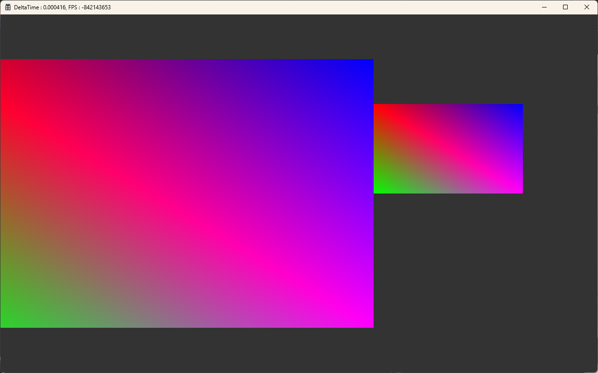

# study_DX2D_AR49
### AR49 수업내용 정리 &amp; 복습

**_Day1_** : 정적 라이브러리와 동적 라이브러리 
**_Day2_** : 동적 라이브러리 런타임 링킹, DirectX 프로젝트 구성 및 설정 
**_Day3_** : Device, DeviceContext, SwapChain 생성 및 초기화 
**_Day4_** : SimpleMath 라이브러리 추가, DEVICE/CONTEXT 메크로 추가, 삼각형 그리기 작업중 
**_Day5_** : 삼각형 그리기 완료 
**_Day6_** : 사각형 그리기(방식1:정점6개, 방식2:정점4개+인덱스버퍼), 객체 움직이기(방식1:VB정보수정,방식2:상수버퍼), 객체 Scale조정 
**_DAY7_** : Asset/Mesh/Shader 클래스 생성, Test 클래스 구조 변경 및 Circle Mesh 출력 코드 추가 
**_DAY8_** : ConstBuffer, CRenderComponent, CMeshRender 클래스 추가, GameObject 객체 2개 출력 
▼ GameObject 객체 2개 출력 

**_DAY9_** : Level, Layer 설계및 코드분리 
**_DAY10_** : Camera 객체추가, Player객체 x,y,z 축 회전 구현 
**_DAY11_** : 카메라 원근,직교 투영기능 추가 
&nbsp;&nbsp;(I,O : 스케일 확대,축소 / P : 카메라 투영변경) 
**_DAY12_** : Rasterizer/DepthStencil/Blend State 추가 
&nbsp;&nbsp;(Rasterizer State 의 Culling 옵션을 none으로 설정함으로써 객체의 후면도 출력된다. default = back) 
**_DAY13_** : DirectXTex 라이브러리 추가 및 텍스처 출력 
&nbsp;&nbsp;test) Mouse Wheel 이벤트 추가 (확대, 축소) 
 
**_DAY14_** : Blend State ONE-ONE 추가, 부모객체, 자식객체 설계, 월드좌표 개념 도입 
&nbsp;&nbsp;test) 다른 이미지 출력(꼬부기, 기본이미지 : 파이리) 
 
**_DAY15_** : 계층구조에 따른 AddObject 구현 및 보완, TaskMgr 구현중, Space 입력시 미사일 발사 이벤트 스크립트 추가 
